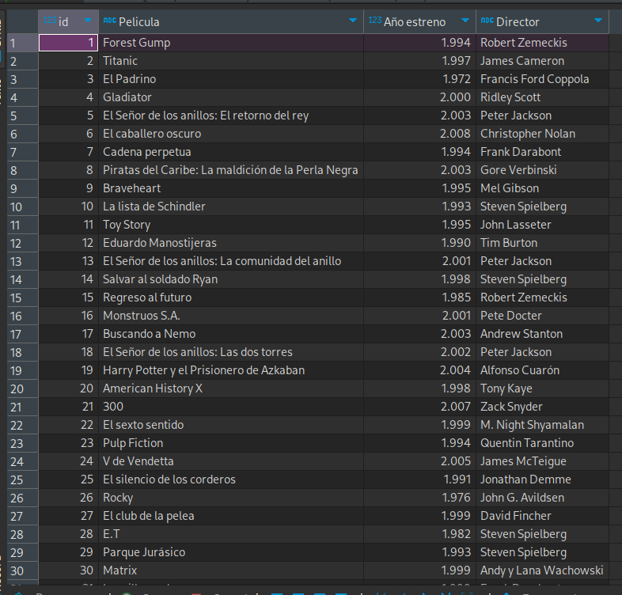
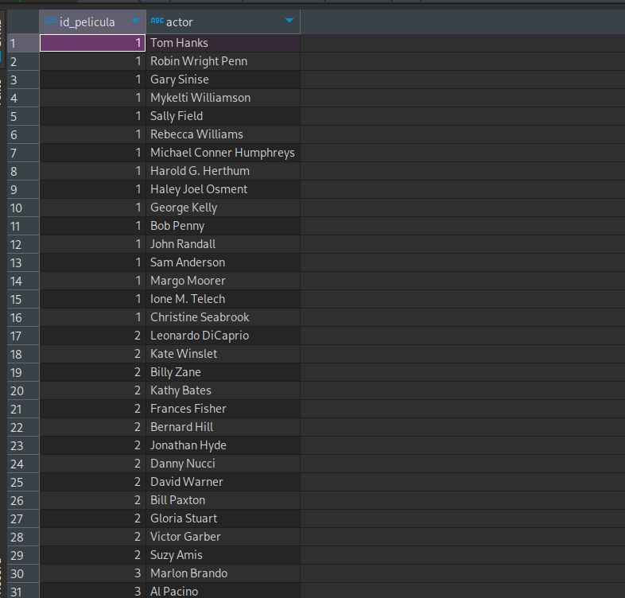
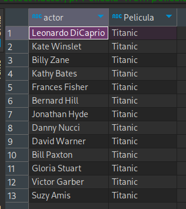
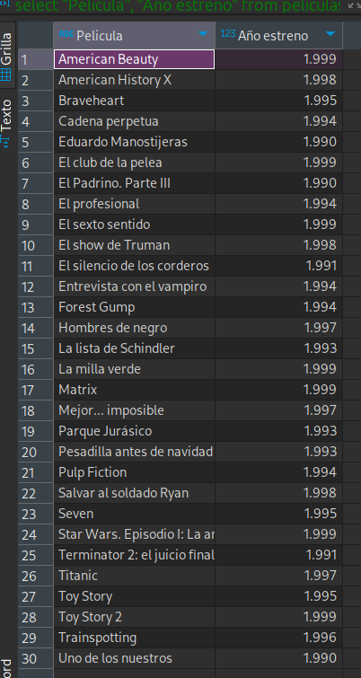
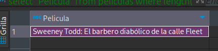

## Desafío Definición de Tablas

1 - Crear una base de datos llamada películas.

    CREATE DATABASE peliculas;

2 - Cargar ambos archivos a su tabla correspondiente.

Se cargan ambos archivos en la base de datos. Creando las tablas peliculas y reparto

3 - Obtener el ID de la película “Titanic”.

    SELECT id FROM peliculas WHERE "Pelicula"  = 'Titanic';

4 - Listar a todos los actores que aparecen en la película "Titanic".

    select r.actor, p."Pelicula"  from peliculas p inner join reparto r on p.id = r.id_pelicula  where p."Pelicula" = 'Titanic';

5 - Consultar en cuántas películas del top 100 participa Harrison Ford

    select count(actor) from reparto where actor = 'Harrison Ford';

6 - Indicar las películas estrenadas entre los años 1990 y 1999 ordenadas por título de
manera ascendente.

    select "Pelicula", "Año estreno"  from peliculas where "Año estreno" >= 1990 and "Año estreno"  <= 1999 order by "Pelicula";

7 - Hacer una consulta SQL que muestre los títulos con su longitud, la longitud debe ser
nombrado para la consulta como “longitud_titulo”.

    select "Pelicula", length("Pelicula")  as longitud_titulo from peliculas;

8 - Consultar cual es la longitud más grande entre todos los títulos de las películas.

    select "Pelicula" from peliculas where length("Pelicula") = (select max(length("Pelicula")) from peliculas);

